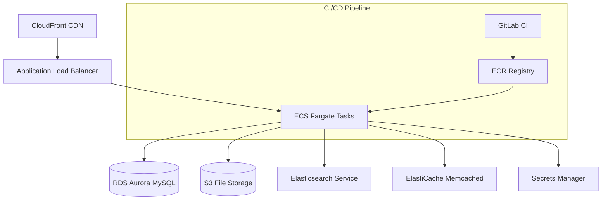

# EPA WebCMS

The EPA WebCMS is a Drupal 10.3-based content management system for EPA.gov that uses the United States Web Design System (USWDS). The project supports both English and Spanish languages and is deployed to AWS using Infrastructure as Code (Terraform) with containerized deployments via ECS Fargate.

## First-Time Setup

**Prerequisites**: DDEV 1.24 or above

1. **Clone and Start**: Clone the repository and start the development environment

   ```bash
   git clone -b main git@github.com:USEPA/webcms.git
   cd services/drupal && ddev start
   ```

2. **AWS Setup**: Create the S3 bucket for s3fs

   ```bash
   ddev aws-setup
   ```

3. **Database Import**: Obtain the latest database dump from Michael Hessling and place the .tar file in `services/drupal/.ddev/db/`

   ```bash
   ddev import-db [--file=path/to/backup.sql.gz]
   ```

   **Note**: For large dumps that may timeout, verify background processing with `docker stats`. If DDEV kills the process, connect directly using the MySQL client via the forwarded port (check with `ddev status`).

4. **Environment Configuration**: Copy the example environment file

   ```bash
   cp .env.example .env
   ```

5. **Install Dependencies**: Install PHP and Node.js dependencies

   ```bash
   ddev composer install
   ddev gesso install
   ```

   If you get composer errors, clear the cache: `ddev composer clearcache`

6. **Build Theme**: Build CSS and Pattern Lab assets

   ```bash
   ddev gesso build
   ```

7. **Apply Configuration**: Install from config (optional, destructive) or apply latest config

   ```bash
   # Option A: Fresh install from config (WIPES DATABASE!)
   ddev drush si --existing-config
   
   # Option B: Apply latest configuration (recommended)
   ddev drush deploy -y
   ```

8. **Enable Caching**: Edit `services/drupal/.env` and change `ENV_STATE=build` to `ENV_STATE=run` to enable memcached

9. **User Setup**: Unblock the admin user

   ```bash
   ddev drush user:unblock drupalwebcms-admin
   ```

10. **Access Site**: Visit <https://epa.ddev.site>

### SSL Certificate Setup

If you get SSL certificate warnings, install mkcert:

```bash
ddev stop --all
mkcert -install
```

For Firefox users, install nss:

```bash
brew install nss  # macOS
mkcert -install
```

## Development Commands

### DDEV Environment Management

```bash
# Start/stop the development environment
ddev start
ddev stop
ddev poweroff    # Stop all DDEV projects

# Container access and status
ddev ssh         # SSH into web container
ddev describe    # Get project details and URLs
ddev status      # Check running services

# Services access
ddev phpmyadmin  # Launch PHPMyAdmin interface
```

### Database Operations

```bash
# Import/export database
ddev import-db [--file=path/to/backup.sql.gz]
ddev export-db   # Exports with current date

# Direct database access via Drush
ddev drush sql:dump > backup.sql
ddev drush sql:cli  # MySQL command line
```

### Drupal/Drush Commands

```bash
# Essential Drush commands
ddev drush cr          # Clear all caches
ddev drush deploy -y   # Apply config changes and run updates
ddev drush cim -y      # Import configuration
ddev drush cex         # Export configuration
ddev drush uli         # Generate one-time login link
ddev drush updb -y     # Run database updates

# Site installation (destructive!)
ddev drush si --existing-config  # Install from config (wipes DB!)

# User management
ddev drush user:unblock drupalwebcms-admin
```

### Theme Development (Gesso)

```bash
# Theme development workflow
ddev gesso install    # Install Node.js dependencies
ddev gesso build      # Build CSS and Pattern Lab assets
ddev gesso watch      # Watch for changes and rebuild

# The theme files are located in web/themes/epa_theme/
```

### Code Quality and Testing

```bash
# PHP Code Sniffer
ddev composer phpcs   # Check coding standards
ddev composer phpcbf   # Fix coding standards

# PHPStan static analysis
ddev composer php-stan

# PHPUnit testing (if configured)
ddev exec phpunit --configuration phpunit.xml.dist
```

### Environment Configuration

```bash
# Environment state management (in .env file)
ENV_STATE=build     # During installation/migration
ENV_STATE=run       # Normal operation (enables memcached)

# Site variants
WEBCMS_LANG=en      # English site (default)
WEBCMS_LANG=es      # Spanish site
```

## Architecture Overview

### Local Development Stack (DDEV)

- **Web Server**: nginx-fpm with PHP 8.2
- **Database**: MySQL 8.0
- **Cache**: Memcached (when ENV_STATE=run)
- **Search**: Elasticsearch
- **Mail**: Mailhog (SMTP testing)
- **File Storage**: Local files + MinIO (S3 simulation)
- **SSL**: mkcert for local HTTPS

### Drupal Application Structure

```
services/drupal/web/
├── modules/
│   └── custom/
│       ├── epa_core/           # Main EPA functionality
│       ├── epa_wysiwyg/        # WYSIWYG customizations
│       └── [other epa_* modules]
├── themes/
│   └── epa_theme/              # Gesso-based USWDS theme
│       ├── gesso_helper/       # Theme helper module
│       └── source/_patterns/   # Pattern Lab components
└── sites/default/
    └── settings.php            # Environment-specific settings
```

### AWS Production Architecture



### Infrastructure Deployment Hierarchy

- **Environment**: preproduction, production
- **Site**: main, integration, release, live
- **Language**: en (English), es (Spanish)

Example resource naming: `WebCMS-preproduction-main-en-service`

## CI/CD Pipeline

### Branch Strategy

- **Feature branches**: Build validation only (no deployment)
- **main**: Deploys to preproduction environment
- **integration**: Deploys to integration environment  
- **release**: Deploys to staging environment
- **live**: Deploys to production environment

### CI/CD Pipeline (GitLab)

- development: builds images, deploys dev (en), then runs Drush updates
- live: preproduction infrastructure (init/validate/plan/apply) — manual gates; staging templates available as templates
- main: allows automatic apply for webcms module per rules

### Environment Variables

- `WEBCMS_IMAGE_TAG`: Branch-build combination for image tagging
- `WEBCMS_ENVIRONMENT`: Target environment (preproduction/production)
- `WEBCMS_SITE`: Target site (main/integration/release/live)
- `WEBCMS_LANG`: Target language (en/es)

## Troubleshooting

### Elasticsearch Issues

```bash
# Reset Elasticsearch volume and re-index
ddev poweroff && docker volume rm ddev-epa-ddev_elasticsearch && ddev start
```

### Theme Build Issues

```bash
# Clear Node modules and rebuild
ddev gesso install --force
ddev gesso build
```

### Database Import Timeouts

```bash
# Use direct MySQL connection for large imports
ddev status  # Note the MySQL port
# Connect directly using MySQL client with forwarded port
```

### Configuration Sync Issues

```bash
# Force configuration import
ddev drush cim --partial -y
ddev drush cr

# If config sync fails, export current config first
ddev drush cex
```

### Cache and Performance

```bash
# Clear all Drupal caches
ddev drush cr

# Restart DDEV if performance is poor
ddev restart
```

## Project Structure

- `services/drupal/`: Main Drupal application
- `terraform/`: Infrastructure as Code modules
  - `network/`: VPC and networking
  - `infrastructure/`: Shared infrastructure (RDS, ECS, etc.)
  - `webcms/`: Application deployment
- `.gitlab/`: GitLab CI pipeline templates
- `.gitlab-ci.yml`: Primary CI/CD pipeline
- `ci/`: Build scripts and utilities
- `docs/`: Comprehensive deployment documentation

## Key Configuration Files

- `services/drupal/.ddev/config.yaml`: DDEV environment configuration
- `services/drupal/.env`: Environment variables (copy from .env.example)
- `services/drupal/composer.json`: PHP dependencies and Drupal modules
- `services/drupal/web/themes/epa_theme/`: Custom theme based on Gesso
- `.gitlab-ci.yml`: Primary CI/CD pipeline

## Additional Resources

- **Terraform Infrastructure**: [terraform/README.md](terraform/README.md)
- **Documentation**: [docs/README.md](docs/README.md)
- **CI/CD Documentation**: [docs/cicd-pipeline.md](docs/cicd-pipeline.md)
- **Deployment Guide**: [docs/deployment-guide.md](docs/deployment-guide.md)
- **Environment Overview**: [docs/environment-overview.md](docs/environment-overview.md)

## Disclaimer

The United States Environmental Protection Agency (EPA) GitHub project code is provided on an "as is" basis and the user assumes responsibility for its use. EPA has relinquished control of the information and no longer has responsibility to protect the integrity, confidentiality, or availability of the information. Any reference to specific commercial products, processes, or services by service mark, trademark, manufacturer, or otherwise, does not constitute or imply their endorsement, recommendation or favoring by EPA. The EPA seal and logo shall not be used in any manner to imply endorsement of any commercial product or activity by EPA or the United States Government.
