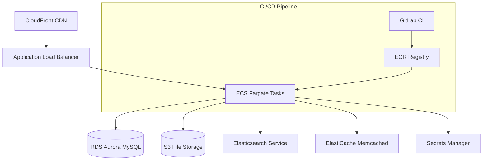

# EPA WebCMS

The EPA WebCMS is a Drupal 10-based content management system for EPA.gov that uses the United States Web Design System (USWDS). The project supports both English and Spanish languages and is deployed to AWS using Infrastructure as Code (Terraform) with containerized deployments via ECS Fargate.

## First-Time Setup

**Prerequisites**: DDEV 1.24 or above

1. **Clone and Start**: Clone the repository and start the development environment

   ```bash
   git clone -b main git@github.com:USEPA/webcms.git
   cd services/drupal && ddev start
   ```

2. **AWS Setup**: Create the S3 bucket for s3fs

   ```bash
   ddev aws-setup
   ```

3. **Database Import**: Obtain the latest database dump from Michael Hessling and place the .tar file in `services/drupal/.ddev/db/`

   ```bash
   ddev import-db [--file=path/to/backup.sql.gz]
   ```

   **Note**: For large dumps that may timeout, verify background processing with `docker stats`. If DDEV kills the process, connect directly using the MySQL client via the forwarded port (check with `ddev status`).

4. **Environment Configuration**: Copy the example environment file

   ```bash
   cp .env.example .env
   ```

5. **Install Dependencies**: Install PHP and Node.js dependencies

   ```bash
   ddev composer install
   ddev gesso install
   ```

   If you get composer errors, clear the cache: `ddev composer clearcache`

6. **Build Theme**: Build CSS and Pattern Lab assets

   ```bash
   ddev gesso build
   ```

7. **Apply Configuration**: Install from config (optional, destructive) or apply latest config

   ```bash
   # Option A: Fresh install from config (WIPES DATABASE!)
   ddev drush si --existing-config
   
   # Option B: Apply latest configuration (recommended)
   ddev drush deploy -y
   ```

8. **Enable Caching**: Edit `services/drupal/.env` and change `ENV_STATE=build` to `ENV_STATE=run` to enable memcached

9. **User Setup**: Unblock the admin user

   ```bash
   ddev drush user:unblock drupalwebcms-admin
   ```

10. **Access Site**: Visit https://epa.ddev.site

## Spanish Site Configuration

The WebCMS supports both English and Spanish language variants with different deployment strategies per environment.

### Environment-Specific Language Support

**Development Environment (`development` branch):**
- ⚠️ **English Only** - Spanish site is not deployed in dev environment
- Only `WEBCMS_LANG=en` is configured for development deployments
- Local development can simulate Spanish site using environment variables

**Staging Environment (`live` branch):**
- ✅ **Both English and Spanish** - Full multilingual deployment
- Parallel deployment jobs for `WEBCMS_LANG: [en, es]`
- Complete staging environment testing for both languages

### Setting Up Spanish Site Locally (Development/Testing)

1. **Configure Language Environment Variable:**
   ```bash
   # In your .env file (for local testing)
   WEBCMS_LANG=es
   ```

2. **Import Spanish Database** (if available):
   ```bash
   # Import Spanish-specific database dump
   ddev import-db --file=path/to/spanish_backup.sql.gz
   ```

3. **Access Sites:**
   - English site: https://epa.ddev.site
   - Spanish site (local simulation): Configure via environment variables

### Language-Specific Configuration Differences

**Database Differences:**
- Spanish site uses separate deployment with `stage-webcms-es` state
- Content translations managed through Drupal's multilingual system
- Language-specific content types and fields

**Theme Differences:**
- Language-specific CSS and styling adjustments
- Locale-specific date/number formatting
- Spanish typography and spacing considerations

**Content Management:**
- Translation workflows for content moderation
- Language-specific taxonomy terms
- Multilingual menu structures

### Deployment Architecture

**CI/CD Pipeline Structure:**
```yaml
# Development (development branch) - English Only
deploy:dev:*:en:
  WEBCMS_LANG: en
  WEBCMS_SITE: dev

# Staging (live branch) - Both Languages
deploy:stage:*:
  parallel:
    matrix:
      - WEBCMS_LANG: [en, es]  # Both languages deployed
  WEBCMS_SITE: stage
```

**Resource Naming:**
- English dev: `site/dev-en`
- Spanish staging: `site/stage-es`
- English staging: `site/stage-en`

### Testing Spanish Features in Development

Since Spanish site is not deployed in dev environment:

1. **Local Environment Testing:**
   ```bash
   # Test Spanish language features locally
   WEBCMS_LANG=es ddev gesso build
   
   # Verify Spanish content rendering
   ddev drush locale:check
   ```

2. **Use Staging Environment:**
   - Deploy to `live` branch for full Spanish site testing
   - Access staging Spanish site for validation

### Troubleshooting Spanish Site Issues

**Note:** Spanish troubleshooting primarily applies to staging/production environments.

1. **Missing Spanish Content:**
   ```bash
   # Check language configuration (staging/prod only)
   drush config:get language.negotiation
   
   # Verify content language settings
   drush config:get language.types
   ```

2. **Translation Interface Problems:**
   ```bash
   # Clear translation caches
   drush locale:clear-cache
   
   # Update translations
   drush locale:update
   ```

3. **Deployment Issues:**
   ```bash
   # Check Spanish deployment status (staging)
   aws ecs describe-services --cluster webcms-preproduction --services WebCMS-preproduction-stage-es
   ```

### SSL Certificate Setup

If you get SSL certificate warnings, install mkcert:

```bash
ddev stop --all
mkcert -install
```

For Firefox users, install nss:

```bash
brew install nss  # macOS
mkcert -install
```

## Development Commands

### DDEV Environment Management

```bash
# Start/stop the development environment
ddev start
ddev stop
ddev poweroff    # Stop all DDEV projects

# Container access and status
ddev ssh         # SSH into web container
ddev describe    # Get project details and URLs
ddev status      # Check running services

# Services access
ddev phpmyadmin  # Launch PHPMyAdmin interface
```

### Database Operations

```bash
# Import/export database
ddev import-db [--file=path/to/backup.sql.gz]
ddev export-db   # Exports with current date

# Direct database access via Drush
ddev drush sql:dump > backup.sql
ddev drush sql:cli  # MySQL command line
```

### Drupal/Drush Commands

```bash
# Essential Drush commands
ddev drush cr          # Clear all caches
ddev drush deploy -y   # Apply config changes and run updates
ddev drush cim -y      # Import configuration
ddev drush cex         # Export configuration
ddev drush uli         # Generate one-time login link
ddev drush updb -y     # Run database updates

# Site installation (destructive!)
ddev drush si --existing-config  # Install from config (wipes DB!)

# User management
ddev drush user:unblock drupalwebcms-admin
```

### Theme Development (Gesso)

```bash
# Theme development workflow
ddev gesso install    # Install Node.js dependencies
ddev gesso build      # Build CSS and Pattern Lab assets
ddev gesso watch      # Watch for changes and rebuild

# The theme files are located in web/themes/epa_theme/
```

### Code Quality and Testing

```bash
# PHP Code Sniffer
ddev composer phpcs   # Check coding standards
ddev composer phpcbf   # Fix coding standards

# PHPStan static analysis
ddev composer php-stan

# PHPUnit testing (if configured)
ddev exec phpunit --configuration phpunit.xml.dist
```

### Environment Configuration

The WebCMS uses environment variables for configuration. Copy `.env.example` to `.env` and modify as needed.

#### Core Environment Variables

```bash
# Environment state management
ENV_STATE=build     # Use during installation/migration (disables caching)
ENV_STATE=run       # Normal operation (enables memcached caching)

# Site and language configuration
WEBCMS_SITE=local        # Site identifier (local, dev, stage, prod)
WEBCMS_SITE_HOSTNAME="localhost:8080"  # Site hostname
WEBCMS_LANG=en           # Language code (en=English, es=Spanish)

# Security
WEBCMS_HASH_SALT=abcdefg  # Drupal hash salt (change for production)
```

#### Database Configuration

```bash
# Primary database (Drupal 10)
WEBCMS_DB_HOST=mysql
WEBCMS_DB_NAME=web
WEBCMS_DB_CREDS={"username":"web","password":"web"}

# Legacy database (Drupal 7 migration)
WEBCMS_DB_NAME_D7=web_d7
WEBCMS_DB_CREDS_D7={"username":"web_d7","password":"web_d7"}
```

#### AWS Services Configuration

```bash
# S3 File Storage
WEBCMS_S3_BUCKET=drupal                    # Primary S3 bucket
WEBCMS_S3_SNAPSHOT_BUCKET=webcms-snapshots # Backup/snapshot bucket
WEBCMS_S3_REGION=us-east-1                 # AWS region

# CloudFront CDN
WEBCMS_CF_DISTRIBUTIONID=abcdef  # CloudFront distribution ID (empty for local)

# CloudWatch Logging
WEBCMS_LOG_GROUP=/webcms-local/app-drupal  # CloudWatch log group
```

#### Cache and Search Configuration

```bash
# Memcached (enabled when ENV_STATE=run)
WEBCMS_CACHE_HOST=memcached

# Elasticsearch
WEBCMS_SEARCH_HOST=http://elasticsearch:9200
```

#### Email Configuration

```bash
# SMTP Settings (uses Mailhog in local development)
WEBCMS_MAIL_HOST=mailhog
WEBCMS_MAIL_PORT=1025
WEBCMS_MAIL_USER=bogus
WEBCMS_MAIL_PASS=bogus
WEBCMS_MAIL_FROM=noreply@epa.local
WEBCMS_MAIL_PROTOCOL=standard
WEBCMS_MAIL_ENABLE_WORKFLOW_NOTIFICATIONS=1
```

#### SAML Authentication Configuration

```bash
# SAML Service Provider (SP) Settings
WEBCMS_SAML_SP_ENTITY_ID="Drupal WebCMS"
WEBCMS_SAML_SP_KEY="[RSA-PRIVATE-KEY]"     # Private key for SAML
WEBCMS_SAML_SP_CERT="[X509-CERTIFICATE]"   # Public certificate

# SAML Identity Provider (IdP) Settings
WEBCMS_SAML_IDP_ID="http://localhost:5000/simplesaml/saml2/idp/metadata.php"
WEBCMS_SAML_IDP_SSO_URL="http://localhost:5000/simplesaml/saml2/idp/SSOService.php"
WEBCMS_SAML_IDP_SLO_URL="http://localhost:5000/simplesaml/saml2/idp/SingleLogoutService.php"
WEBCMS_SAML_IDP_CERT="[IDP-X509-CERTIFICATE]"  # IdP public certificate

# SAML Control
WEBCMS_SAML_FORCE_SAML_LOGIN=0  # Set to 1 to force SAML login
```

**Note:** Replace certificate and key placeholders with actual values in production.

## Architecture Overview

### Local Development Stack (DDEV)

- **Web Server**: nginx-fpm with PHP 8.2
- **Database**: MySQL 8.0
- **Cache**: Memcached (when ENV_STATE=run)
- **Search**: Elasticsearch
- **Mail**: Mailhog (SMTP testing)
- **File Storage**: Local files + MinIO (S3 simulation)
- **SSL**: mkcert for local HTTPS

### Drupal Application Structure

```
services/drupal/web/
├── modules/
│   └── custom/
│       ├── epa_core/           # Main EPA functionality
│       ├── epa_wysiwyg/        # WYSIWYG customizations
│       └── [other epa_* modules]
├── themes/
│   └── epa_theme/              # Gesso-based USWDS theme
│       ├── gesso_helper/       # Theme helper module
│       └── source/_patterns/   # Pattern Lab components
└── sites/default/
    └── settings.php            # Environment-specific settings
```

### AWS Production Architecture



### Infrastructure Deployment Hierarchy

- **Environment**: preproduction, production
- **Site**: main, integration, release, live
- **Language**: en (English), es (Spanish)

Example resource naming: `WebCMS-preproduction-main-en-service`

## CI/CD Pipeline

### Branch Strategy

- **Feature branches**: Build validation only (no deployment)
- **main**: Deploys to preproduction environment
- **integration**: Deploys to integration environment  
- **release**: Deploys to staging environment
- **live**: Deploys to production environment

### CI/CD Pipeline (GitLab)

- development: builds images, deploys dev (en), then runs Drush updates
- live: preproduction infrastructure (init/validate/plan/apply) — manual gates; staging templates available as templates
- main: allows automatic apply for webcms module per rules

### Environment Variables

- `WEBCMS_IMAGE_TAG`: Branch-build combination for image tagging
- `WEBCMS_ENVIRONMENT`: Target environment (preproduction/production)
- `WEBCMS_SITE`: Target site (main/integration/release/live)
- `WEBCMS_LANG`: Target language (en/es)

## Troubleshooting

### Elasticsearch Issues

```bash
# Reset Elasticsearch volume and re-index
ddev poweroff && docker volume rm ddev-epa-ddev_elasticsearch && ddev start
```

### Theme Build Issues

```bash
# Clear Node modules and rebuild
ddev gesso install --force
ddev gesso build
```

### Database Import Timeouts

```bash
# Use direct MySQL connection for large imports
ddev status  # Note the MySQL port

# Method 1: Direct MySQL connection
mysql -h127.0.0.1 -P<port-from-ddev-status> -uweb -pweb web < backup.sql

# Method 2: Split large files
split -l 10000 backup.sql backup_part_
for file in backup_part_*; do
  ddev import-db --file="$file"
done

# Method 3: Increase timeout
ddev config --web-extra-exposed-ports=3307
ddev restart
```

### Configuration Sync Issues

```bash
# Force configuration import
ddev drush cim --partial -y
ddev drush cr

# If config sync fails, export current config first
ddev drush cex
```

### Database Issues

```bash
# Check database connection
ddev drush sql:cli --extra="--execute='SELECT 1'"

# Database corruption recovery
ddev drush sql:dump > backup_before_repair.sql
ddev drush sql:cli --extra="--execute='REPAIR TABLE cache_bootstrap'"

# Reset database permissions
ddev drush sql:cli --extra="--execute='FLUSH PRIVILEGES'"

# Check database size and optimize
ddev drush sql:cli --extra="--execute='SELECT table_name, ROUND(((data_length + index_length) / 1024 / 1024), 2) as size_mb FROM information_schema.TABLES WHERE table_schema = DATABASE() ORDER BY size_mb DESC LIMIT 10'"

# Optimize large tables
ddev drush sql:cli --extra="--execute='OPTIMIZE TABLE cache_render, cache_data'"
```

### Production Deployment Procedures

#### Pre-Deployment Checklist

```bash
# 1. Backup current database
aws rds create-db-snapshot --db-instance-identifier webcms-prod --db-snapshot-identifier webcms-backup-$(date +%Y%m%d-%H%M%S)

# 2. Test deployment in staging
git checkout release
# Wait for GitLab pipeline to complete staging deployment

# 3. Verify staging functionality
curl -I https://staging.epa.gov/health-check

# 4. Check for pending configuration changes
ddev drush config:status
```

#### Production Deployment Steps

```bash
# 1. Create maintenance page
aws elbv2 modify-rule --rule-arn <maintenance-rule-arn> --actions Type=fixed-response,FixedResponseConfig='{StatusCode=503,ContentType=text/html,MessageBody=Under Maintenance}'

# 2. Deploy to production (GitLab)
git checkout live
git push origin live
# Monitor GitLab pipeline progress

# 3. Run post-deployment tasks
# Database updates run automatically via CI/CD
# Verify via ECS task logs in CloudWatch

# 4. Smoke test production
curl -I https://www.epa.gov/health-check

# 5. Remove maintenance page
aws elbv2 modify-rule --rule-arn <maintenance-rule-arn> --actions Type=forward,TargetGroupArn=<production-target-group>
```

#### Post-Deployment Verification

```bash
# Check ECS service health
aws ecs describe-services --cluster webcms-production --services WebCMS-production-live-en

# Monitor CloudWatch logs
aws logs filter-log-events --log-group-name /webcms/production/app-drupal --start-time $(date -d '10 minutes ago' +%s)000

# Verify cache warming
curl -s https://www.epa.gov/sitemap.xml | head -20

# Check Spanish site
curl -I https://espanol.epa.gov/health-check
```

#### Rollback Procedures

```bash
# Method 1: Rollback via GitLab (preferred)
# Revert commit and push to live branch
git revert <commit-hash>
git push origin live

# Method 2: ECS service rollback
aws ecs update-service --cluster webcms-production --service WebCMS-production-live-en --task-definition WebCMS-production-live-en:<previous-revision>

# Method 3: Database rollback (if needed)
aws rds restore-db-instance-from-db-snapshot --db-instance-identifier webcms-prod-rollback --db-snapshot-identifier <snapshot-id>
# Update connection strings to point to rollback instance
```

### Cache and Performance

```bash
# Clear all Drupal caches
ddev drush cr

# Clear specific cache bins
ddev drush cache:clear render
ddev drush cache:clear dynamic_page_cache

# Restart DDEV if performance is poor
ddev restart

# Check memory usage
ddev exec php -i | grep memory_limit

# Monitor performance
ddev logs -f
```

## Project Structure

- `services/drupal/`: Main Drupal application
- `terraform/`: Infrastructure as Code modules
  - `network/`: VPC and networking
  - `infrastructure/`: Shared infrastructure (RDS, ECS, etc.)
  - `webcms/`: Application deployment
- `.gitlab/`: GitLab CI pipeline templates
- `.gitlab-ci.yml`: Primary CI/CD pipeline
- `ci/`: Build scripts and utilities
- `docs/`: Comprehensive deployment documentation

## Key Configuration Files

- `services/drupal/.ddev/config.yaml`: DDEV environment configuration
- `services/drupal/.env`: Environment variables (copy from .env.example)
- `services/drupal/composer.json`: PHP dependencies and Drupal modules
- `services/drupal/web/themes/epa_theme/`: Custom theme based on Gesso
- `.gitlab-ci.yml`: Primary CI/CD pipeline

## Additional Resources

- **Terraform Infrastructure**: [terraform/README.md](terraform/README.md)
- **Documentation**: [docs/README.md](docs/README.md)
- **CI/CD Documentation**: [docs/cicd-pipeline.md](docs/cicd-pipeline.md)
- **Deployment Guide**: [docs/deployment-guide.md](docs/deployment-guide.md)
- **Environment Overview**: [docs/environment-overview.md](docs/environment-overview.md)

## Disclaimer

The United States Environmental Protection Agency (EPA) GitHub project code is provided on an "as is" basis and the user assumes responsibility for its use. EPA has relinquished control of the information and no longer has responsibility to protect the integrity, confidentiality, or availability of the information. Any reference to specific commercial products, processes, or services by service mark, trademark, manufacturer, or otherwise, does not constitute or imply their endorsement, recommendation or favoring by EPA. The EPA seal and logo shall not be used in any manner to imply endorsement of any commercial product or activity by EPA or the United States Government.
