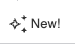
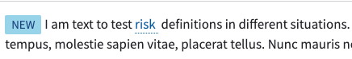
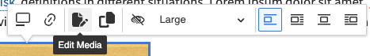
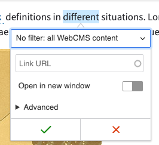
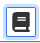
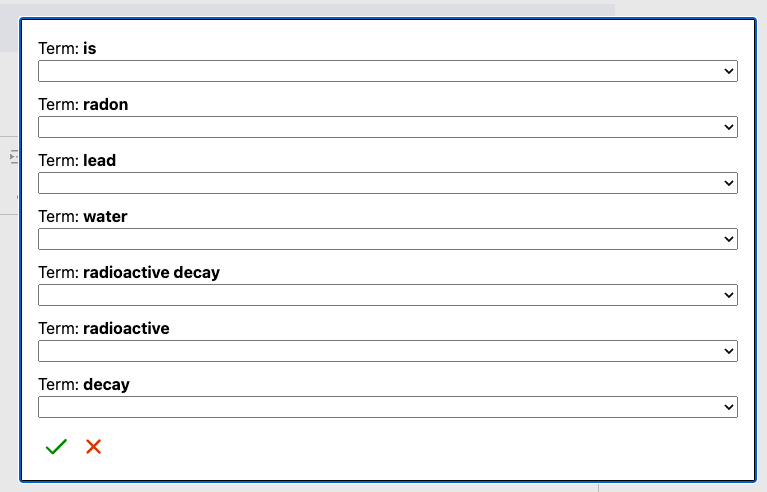
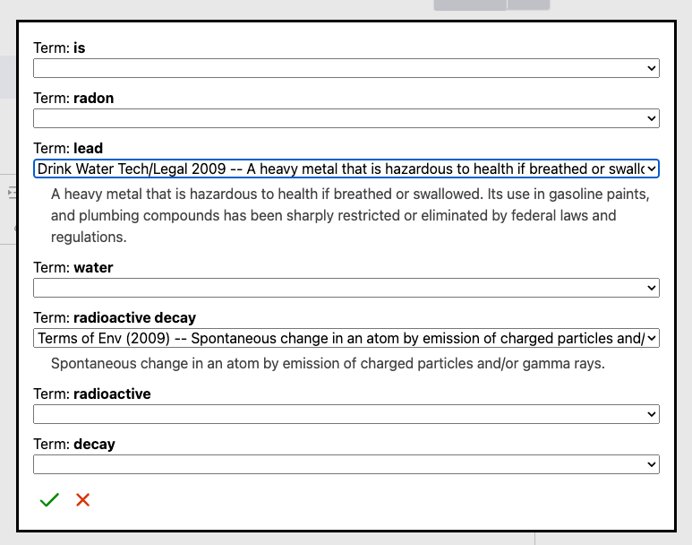
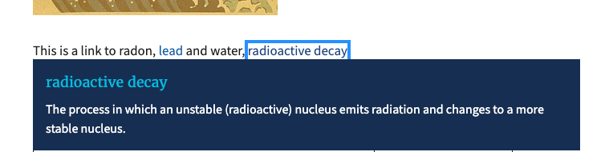

# EPA WYSIWYG
The goal of this module is to provide a few custom plugins for the CKEditor WYSIWYG. The code in this module currently supports both CKEditor 4 and CKEditor 5. After CKEditor 5 goes live we'll want to look to remove the CKEditor 4 hooks and plugin code that are no longer used.

## Developing Plugins
These plugins were initially scaffolded using the plugin starter template provided by https://www.drupal.org/project/ckeditor5_dev. In this module contains the same build setup as prescribed in that module.

When working on updates for any of the plugins in this module you will need to ensure that you have `npm` installed.

1. `npm install` to setup the necessary assets
2. `npm build` to run a one time build or `npm watch` to continually watch for new changes -- These will compile and minify the plugin code from the `js/ckeditor5_plugins` directory to their corresponding plugin directory in the `js/build`  directory which is what is ultimately delivered to the browser as part of the plugin's library (see `epa_wysiwyg.ckeditor5.yml` & `epa_wysiwyg.libraries.yml`).
   1. Note: Changes should be committed in git for both directories.

## Plugin Overview

### "New" tag plugin
**Plugin Button**

**Example Usage**

This plugin allows content authors to add a "New" tag that displays inline with whatever content the user has selected. When this inline element is added, it gets a data attribute that tracks when it was added. Then when rendered to the page, the "epa-new" library (included with this module) will run, check the dates of all "New" tags and if the date is 30 days or more in the past, will remove the class that provides all the styling for the element and thus no longer be "new".

### Edit Media plugin
**Example usage**

This plugin adds a couple additional buttons to the Media Embed "contextual balloon" in CKEditor 5 for adding the functionality to copy the file path to the media item and a quick link to head over to the media edit page.

### Web Area Linkit plugin
**Example Usage**

This plugin adds the ability for content authors to swap between different linkit profiles when adding a link. There are only two profiles currently, "All WebCMS content" and "Only within my Web Areas"

### EPA Add Definitions Plugin
**Plugin Button**

This plugin allows content authors to highlight specific keywords / phrases to then add additional "definition" markup to them. This enables viewers of the page to quickly see the definition of the word as EPA defines it.

The plugin then searches the highlighted string against EPA's https://termlookup.epa.gov lookup site for any found definitions. If any definitions exist for the highlighted string it returns them in a dialog with each term or phrase getting their own dropdown.
In the below example the following sentence was highlighted and searched; "This is a link to radon, lead and water, radioactive decay".

_Note: Some words have their own individual definition or if used together have a phrase definition as you can see with the example "radioactive decay"_

A content author can then choose to select one of the definitions for each of their keyword or phrases found and will display the full definition below the term.

On display, these definitions appear similar to a link and when they are clicked on by the user will display the additional definition markup.

